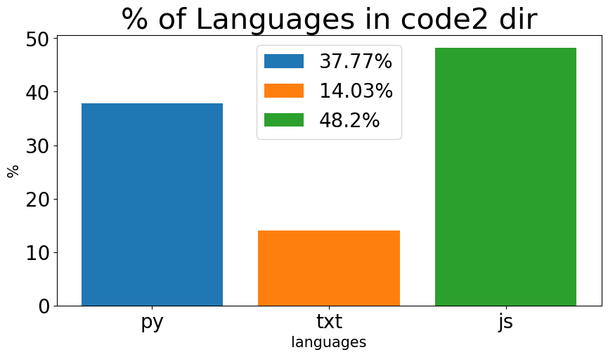

# Project: Code Lines Scanner

## Overview
This project is a Python script designed to scan a specified folder, count the number of lines of code in each file, and generate a summary of the percentage distribution of file extensions (or languages) within the folder. The results are visualized using bar charts and saved as images in a designated folder.

## Features
- Scans a folder for files.
- Counts the number of lines of code in each file.
- Calculates the percentage distribution of file extensions (languages) in the folder.
- Generates a bar chart showing the percentage distribution.
- Saves the resulting bar chart as an image with a timestamp.
- Automatically creates a folder named `SCAN` to store the output images.

## Dependencies
- Python 3
- `matplotlib`
- `datetime`

## How to Use
1. Clone this repository or download the script.
2. Ensure you have Python installed with the required dependencies.
3. Run the script `scan.py` in your terminal or IDE.

### Example
```bash
python scan.py
```
When prompted, enter the path of the folder you want to scan.

### Input Example:
```
Enter folder to scan: CODE
```

### Output Example:
The script generates and saves an image of a bar chart in the `SCAN` folder. For instance:
- `code_2024-12-25_.png` (for folder `CODE`)
- `code2_2024-12-25_.png` (for folder `CODE2`)

## File Details
- **`scan.py`**: The main script for scanning folders and generating visualizations.
- **`SCAN` folder**: Stores the output images (bar charts).

## Sample Output
The bar charts show the percentage distribution of file extensions (languages) in the scanned folder. Below are examples of the generated images:

### Bar Chart for Folder `CODE`:


### Bar Chart for Folder `CODE2`:


## Notes
- Ensure the folder you provide exists and contains readable files.
- Images generated are timestamped to prevent overwriting existing results.

## Future Enhancements
- Add support for nested directories.
- Include error handling for invalid or unreadable files.
- Generate additional visualizations, such as pie charts, for better analysis.